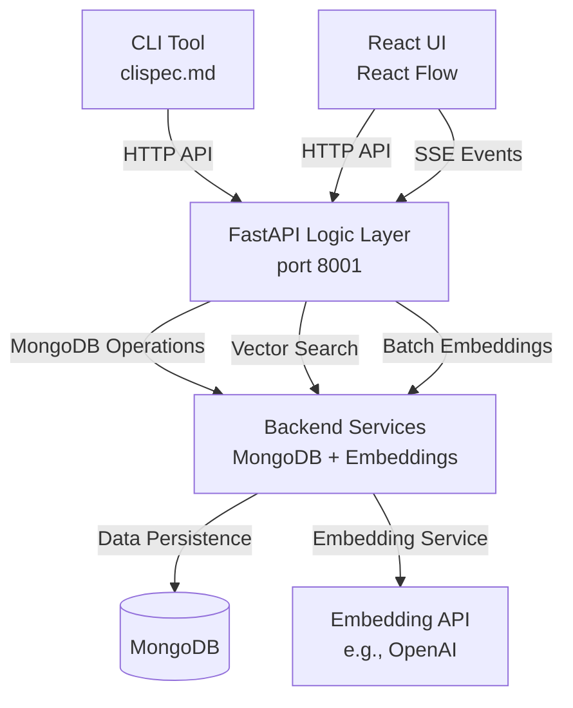
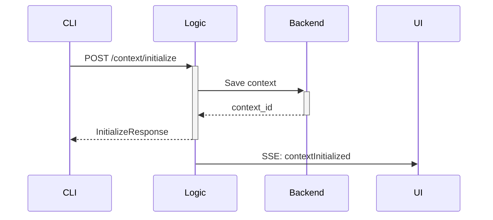
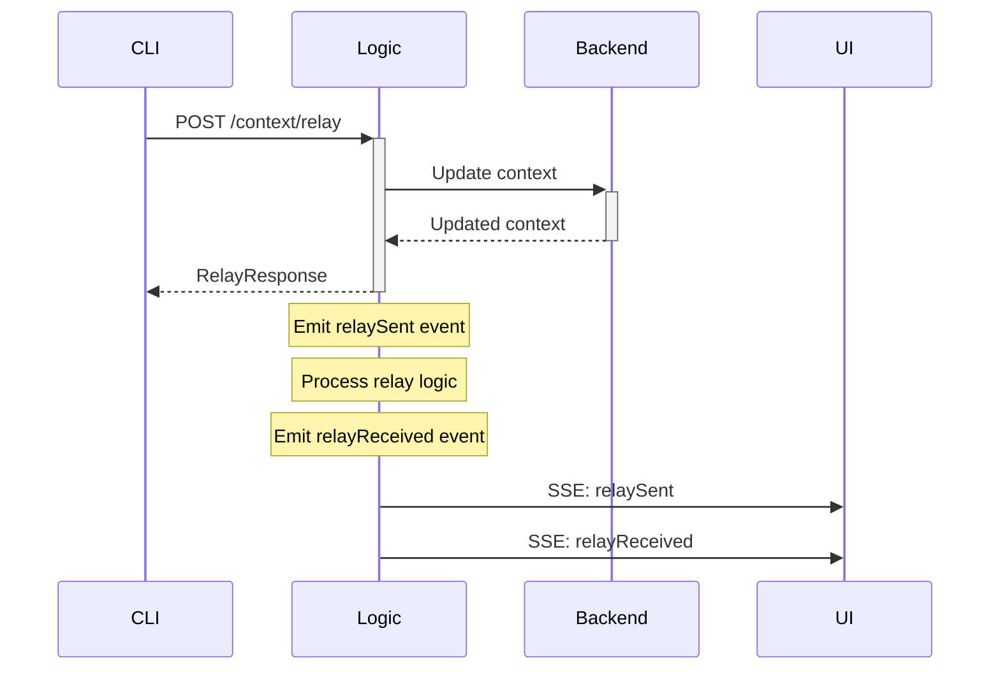
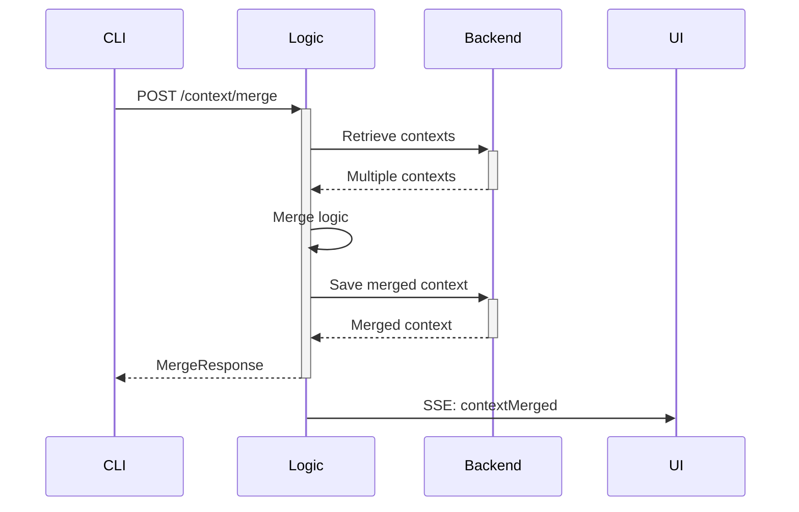

# Context Relay Architecture

## System Overview

The Context Relay system consists of four main components that work together to enable context sharing between AI agents.



## Component Ownership

| Component | Owner | Responsibilities |
|-----------|-------|------------------|
| **CLI Tool** | CLI Developer | Command execution, mock data generation, API testing |
| **FastAPI Logic Layer** | Logic Developer | Business logic, SSE events, request/response handling |
| **React UI** | Frontend Developer | Visualization, user interactions, real-time updates |
| **Backend Services** | Backend Developer | Data persistence, embeddings, vector search |

## Data Flow

### 1. Context Initialization


### 2. Context Relay


### 3. Context Merge


## API Endpoints

### REST API (Port 8001)
- `POST /context/initialize` - Create new context
- `POST /context/relay` - Relay context between agents
- `POST /context/merge` - Merge multiple contexts
- `POST /context/prune` - Reduce context size
- `POST /context/version` - Create version snapshot
- `GET /context/{id}` - Retrieve context
- `GET /context/versions/{id}` - List versions

### SSE Events
- `GET /events/relay` - Real-time event stream

## Event Types

| Event | When Emitted | UI Action |
|-------|--------------|-----------|
| `contextInitialized` | New context created | Add new node |
| `relaySent` | Context relay initiated | Animate edge (blue) |
| `relayReceived` | Context relay completed | Animate edge (green) |
| `contextMerged` | Contexts merged | Collapse nodes, add new node |
| `contextPruned` | Context reduced | Update node size |
| `versionCreated` | Snapshot created | Add version marker |

## Configuration

### Environment Variables
```bash
# Logic Layer
CONTEXT_RELAY_API_URL=http://localhost:8001
CONTEXT_RELAY_EVENTS_URL=http://localhost:8001/events/relay

# Backend (configured by backend team)
MONGODB_URL=mongodb://localhost:27017
EMBEDDING_API_KEY=your_api_key
```

### Frontend Configuration
```javascript
// Frontend can consume shared_schema.json for TypeScript types
const API_BASE_URL = process.env.CONTEXT_RELAY_API_URL || 'http://localhost:8001';
const EVENTS_URL = process.env.CONTEXT_RELAY_EVENTS_URL || 'http://localhost:8001/events/relay';
```

## Development Status

- ✅ **Phase 1 Complete**: Logic layer with BDD tests
- 🔄 **Phase 2 In Progress**: Backend integration
- ⏳ **Phase 3**: Frontend UI development
- ⏳ **Phase 4**: CLI tool implementation

## Next Steps for Frontend Team

1. **Set up SSE connection** to `/events/relay`
2. **Consume `shared_schema.json`** for TypeScript types
3. **Implement visualization** for each event type
4. **Add API integration** for context operations
5. **Test with CLI** using examples from `clispec.md`